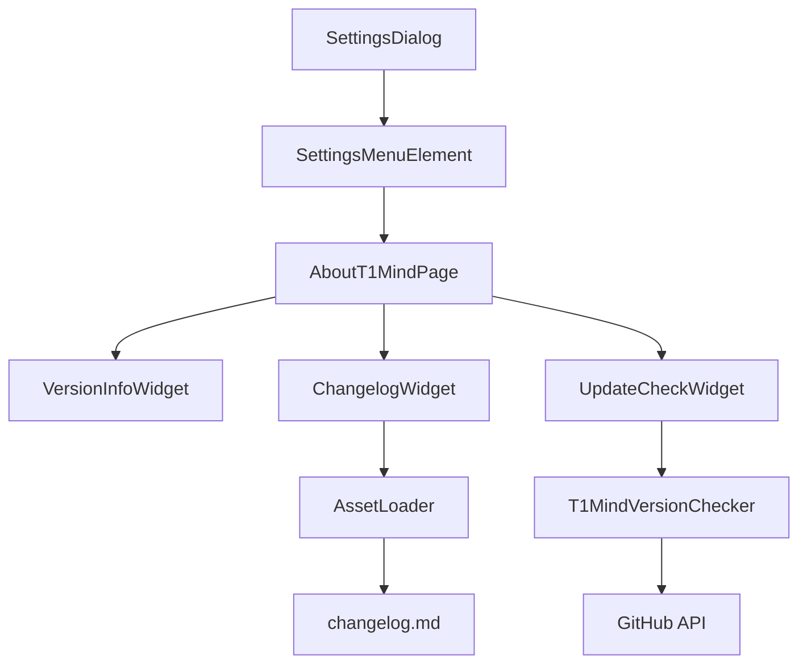

# Design Document

## Overview

为AppFlowy添加"关于t1mind"功能，在全局设置中新增一个专门的页面，用户可以查看当前应用的版本信息、编译信息，以及从内嵌的changelog.md文件中显示的版本更新内容。同时修改现有的版本检查逻辑，使其从t1mind的GitHub仓库获取最新版本信息，并提供相应的更新提醒。

## Steering Document Alignment

### Technical Standards (tech.md)
遵循AppFlowy现有的技术架构模式：
- Flutter前端使用BLoC/Cubit状态管理
- Rust后端提供核心功能支持
- 使用protobuf进行前后端通信
- 遵循现有的代码生成和构建流程

### Project Structure (structure.md)
遵循AppFlowy的项目组织结构：
- 设置页面位于`lib/workspace/presentation/settings/pages/`
- 移动端设置位于`lib/mobile/presentation/setting/`
- 共享组件位于`lib/shared/`
- 国际化文件位于`assets/translations/`

## Code Reuse Analysis

### Existing Components to Leverage
- **SettingsDialog**: 现有的设置对话框框架，用于集成新的关于页面
- **SettingsMenuElement**: 设置菜单项组件，用于添加"关于t1mind"选项
- **VersionChecker**: 现有的版本检查器，需要扩展以支持GitHub API
- **ApplicationInfo**: 现有的应用信息类，需要扩展以支持t1mind品牌信息
- **SettingsBody**: 设置页面主体组件，用于构建关于页面布局
- **MobileSettingGroup**: 移动端设置组组件，用于移动端关于页面

### Integration Points
- **SettingsPage枚举**: 需要添加新的aboutT1mind页面类型
- **Asset Bundle**: 需要将changelog.md文件打包到assets中
- **Localization系统**: 需要添加中英文翻译支持
- **GitHub API**: 需要集成GitHub Releases API进行版本检查

## Architecture

### Modular Design Principles
- **Single File Responsibility**: 关于页面组件专注于版本信息显示，版本检查逻辑独立封装
- **Component Isolation**: 创建独立的关于页面组件，不与其他设置页面耦合
- **Service Layer Separation**: 版本检查服务独立于UI层，支持不同数据源配置
- **Utility Modularity**: 版本信息解析和changelog处理功能模块化



## Components and Interfaces

### AboutT1MindPage
- **Purpose:** 主要的关于t1mind页面组件，整合版本信息、changelog和更新检查功能
- **Interfaces:** 
  - `build(BuildContext context) -> Widget`
  - `static Widget create()` 工厂方法
- **Dependencies:** SettingsBody, VersionInfoWidget, ChangelogWidget, UpdateCheckWidget
- **Reuses:** 现有的设置页面布局模式和主题系统

### T1MindVersionChecker
- **Purpose:** 扩展现有的VersionChecker，支持从GitHub获取t1mind版本信息
- **Interfaces:**
  - `Future<AppcastItem?> checkForT1MindUpdate()`
  - `void setT1MindFeedUrl(String url)`
- **Dependencies:** http包，现有的VersionChecker基类
- **Reuses:** 现有的版本检查逻辑和错误处理机制

### ChangelogLoader
- **Purpose:** 负责加载和解析内嵌的changelog.md文件
- **Interfaces:**
  - `Future<String> loadChangelogContent()`
  - `String parseChangelog(String rawContent)`
- **Dependencies:** Flutter的rootBundle，markdown解析库
- **Reuses:** 现有的asset加载模式

### VersionInfoWidget
- **Purpose:** 显示当前版本信息的UI组件
- **Interfaces:**
  - `Widget build(BuildContext context)`
- **Dependencies:** ApplicationInfo，AppFlowy主题系统
- **Reuses:** 现有的文本样式和布局组件

### ChangelogWidget
- **Purpose:** 显示changelog内容的UI组件
- **Interfaces:**
  - `Widget build(BuildContext context)`
- **Dependencies:** ChangelogLoader，滚动组件
- **Reuses:** 现有的文本显示和滚动组件

### UpdateCheckWidget
- **Purpose:** 显示更新检查和下载链接的UI组件
- **Interfaces:**
  - `Widget build(BuildContext context)`
- **Dependencies:** T1MindVersionChecker，URL启动器
- **Reuses:** 现有的按钮组件和链接处理逻辑

## Data Models

### T1MindVersionInfo
```
- currentVersion: String
- buildNumber: String
- buildDate: DateTime
- appName: String ("t1mind")
- changelogContent: String
- latestVersion: String?
- updateAvailable: bool
- downloadUrl: String?
```

### ChangelogEntry
```
- version: String
- date: DateTime?
- changes: List<String>
- type: ChangeType (feature, bugfix, breaking)
```

## Error Handling

### Error Scenarios
1. **网络连接失败**
   - **Handling:** 显示离线状态，不显示更新提醒
   - **User Impact:** 用户看到"无法检查更新"的友好提示

2. **changelog.md文件缺失**
   - **Handling:** 显示默认的版本信息，不报错
   - **User Impact:** 用户看到基本的版本信息，没有changelog内容

3. **GitHub API限制**
   - **Handling:** 记录错误日志，使用缓存的上次检查结果
   - **User Impact:** 用户可能看到过期的更新信息

4. **版本解析失败**
   - **Handling:** 回退到字符串比较，记录警告日志
   - **User Impact:** 更新检查可能不准确，但不会崩溃

## Testing Strategy

### Unit Testing
- T1MindVersionChecker的版本比较逻辑
- ChangelogLoader的文件解析功能
- 版本信息格式化函数

### Integration Testing
- 关于页面的完整加载流程
- 版本检查的网络请求和响应处理
- 不同平台上的UI显示一致性

### End-to-End Testing
- 用户从设置菜单打开关于页面的完整流程
- 更新提醒的显示和点击跳转功能
- 多语言环境下的文本显示
