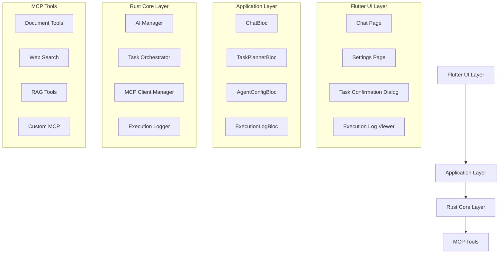

# AI聊天MCP工具编排功能 — 设计说明（Design）

## 概述

本设计文档描述了为Appflowy AI聊天功能增加MCP工具调用和智能体任务规划执行能力的技术实现方案。该功能将在现有AI聊天架构基础上，增加任务规划器、执行器、用户确认机制和执行追溯能力，支持跨平台部署。

## 指导文档对齐

### 技术标准
- 遵循Appflowy现有的BLoC状态管理模式
- 采用Rust FFI + Flutter的跨平台架构
- 保持模块化设计和单一职责原则
- 使用现有的国际化和主题系统

### 项目结构
- Flutter UI层：`appflowy_flutter/lib/plugins/ai_chat/`
- Rust核心层：`rust-lib/flowy-ai/src/`
- FFI接口层：`rust-lib/dart-ffi/src/`
- 资源文件：`resources/translations/`

## 代码复用分析

### 现有组件复用

- **ChatBloc**: 扩展现有聊天状态管理，增加任务规划和执行状态
- **AgentService**: 基于现有的智能体服务框架进行增强
- **MCPClientManager**: 复用现有MCP客户端管理器
- **ChatMessageStream**: 扩展消息流处理，支持执行日志流
- **SettingsAIBloc**: 扩展AI设置管理，增加智能体配置

### 集成点

- **现有聊天UI**: 在`chat_footer.dart`中集成MCP选择器
- **消息渲染**: 扩展`ai_text_message.dart`支持执行日志显示
- **设置界面**: 在现有AI设置页面中增加智能体管理
- **数据存储**: 集成现有的KV存储和SQLite数据库

## 架构

本功能采用分层架构，在现有AI聊天系统基础上增加任务编排层：



### 模块化设计原则

- **单文件职责**: 每个文件处理单一关注点或领域
- **组件隔离**: 创建小型、专注的组件而非大型单体文件
- **服务层分离**: 分离数据访问、业务逻辑和表示层
- **工具模块化**: 将工具分解为专注的单一目的模块

## 组件和接口

### 组件1: TaskPlannerBloc

- **目的**: 管理任务规划状态和用户确认流程
- **接口**: 
  - `planTask(String userQuery, List<String> selectedMcpIds)`
  - `confirmPlan(TaskPlan plan)`
  - `rejectPlan(String reason)`
- **依赖**: ChatBloc, AI Manager
- **复用**: 基于现有BLoC模式，复用ChatBloc的状态管理机制

### 组件2: TaskExecutorService

- **目的**: 执行任务计划，调用MCP工具并管理执行流程
- **接口**:
  - `executeTask(TaskPlan plan, ExecutionContext context)`
  - `cancelExecution(String executionId)`
  - `getExecutionStatus(String executionId)`
- **依赖**: MCP Client Manager, Execution Logger
- **复用**: 扩展现有AgentExecutor，集成MCPClientManager

### 组件3: AgentConfigManager

- **目的**: 管理智能体配置和权限设置
- **接口**:
  - `createAgent(AgentConfig config)`
  - `updateAgent(String agentId, AgentConfig config)`
  - `getAvailableTools(String agentId)`
- **依赖**: Settings Storage, MCP Manager
- **复用**: 集成现有SettingsAIBloc和KV存储

### 组件4: ExecutionLogViewer

- **目的**: 显示和管理执行日志，支持追溯和导出
- **接口**:
  - `showExecutionLog(String executionId)`
  - `exportLog(String executionId, ExportFormat format)`
  - `searchLogs(LogSearchCriteria criteria)`
- **依赖**: Execution Logger, UI Components
- **复用**: 基于现有聊天消息渲染组件

### 组件5: McpToolSelector

- **目的**: 在聊天界面提供MCP工具选择功能
- **接口**:
  - `getAvailableTools()`
  - `selectTools(List<String> toolIds)`
  - `validateToolAvailability(List<String> toolIds)`
- **依赖**: MCP Client Manager, UI State
- **复用**: 集成到现有chat_footer.dart组件

## 数据模型

### TaskPlan
```dart
class TaskPlan {
  final String id;
  final String userQuery;
  final String overallStrategy;
  final List<TaskStep> steps;
  final List<String> requiredMcpTools;
  final DateTime createdAt;
  final TaskPlanStatus status;
}
```

### TaskStep
```dart
class TaskStep {
  final String id;
  final String description;
  final String mcpToolId;
  final Map<String, dynamic> parameters;
  final List<String> dependencies;
  final TaskStepStatus status;
}
```

### AgentConfig
```dart
class AgentConfig {
  final String id;
  final String name;
  final String personality;
  final String systemPrompt;
  final List<String> allowedTools;
  final List<String> deniedTools;
  final String languagePreference;
  final DateTime createdAt;
  final DateTime updatedAt;
}
```

### ExecutionLog
```dart
class ExecutionLog {
  final String id;
  final String sessionId;
  final String taskPlanId;
  final List<ExecutionStep> steps;
  final DateTime startTime;
  final DateTime? endTime;
  final ExecutionStatus status;
  final String? errorMessage;
}
```

### ExecutionStep
```dart
class ExecutionStep {
  final String id;
  final String stepDescription;
  final String mcpToolName;
  final Map<String, dynamic> inputParameters;
  final Map<String, dynamic>? outputResult;
  final Duration executionTime;
  final List<String> references;
  final StepStatus status;
}
```

### McpToolInfo
```dart
class McpToolInfo {
  final String id;
  final String name;
  final String description;
  final McpTransportType transport;
  final Map<String, dynamic> schema;
  final bool isAvailable;
  final DateTime lastChecked;
}
```

## Rust核心层数据模型

### TaskOrchestrator (Rust)
```rust
pub struct TaskOrchestrator {
    mcp_manager: Arc<MCPClientManager>,
    execution_logger: Arc<ExecutionLogger>,
    agent_configs: Arc<RwLock<HashMap<String, AgentConfig>>>,
}

impl TaskOrchestrator {
    pub async fn plan_task(&self, query: &str, available_tools: &[String]) -> Result<TaskPlan>;
    pub async fn execute_plan(&self, plan: TaskPlan) -> Result<ExecutionResult>;
    pub async fn cancel_execution(&self, execution_id: &str) -> Result<()>;
}
```

### ExecutionLogger (Rust)
```rust
pub struct ExecutionLogger {
    db_connection: Arc<SqliteConnection>,
}

impl ExecutionLogger {
    pub async fn log_execution_start(&self, plan: &TaskPlan) -> Result<String>;
    pub async fn log_step_completion(&self, execution_id: &str, step: ExecutionStep) -> Result<()>;
    pub async fn get_execution_history(&self, session_id: &str) -> Result<Vec<ExecutionLog>>;
}
```

## 错误处理

### 错误场景

1. **MCP工具不可用**
   - **处理**: 显示工具状态，提供替代方案或跳过该工具
   - **用户影响**: 显示警告信息，允许用户选择继续或重新规划

2. **任务规划失败**
   - **处理**: 记录错误日志，回退到普通聊天模式
   - **用户影响**: 显示错误信息，提供重试选项

3. **执行超时**
   - **处理**: 取消当前执行，保存部分结果
   - **用户影响**: 显示超时信息，提供查看部分结果的选项

4. **权限不足**
   - **处理**: 检查智能体权限配置，跳过无权限的工具
   - **用户影响**: 显示权限警告，建议联系管理员

5. **网络连接问题**
   - **处理**: 实现重试机制，缓存离线数据
   - **用户影响**: 显示连接状态，提供离线模式

## FFI接口设计

### Dart到Rust事件

```dart
// 任务规划事件
class PlanTaskEvent {
  final String userQuery;
  final List<String> selectedMcpIds;
  final String agentId;
}

// 执行任务事件
class ExecuteTaskEvent {
  final String taskPlanId;
  final Map<String, dynamic> executionContext;
}

// 取消执行事件
class CancelExecutionEvent {
  final String executionId;
}
```

### Rust到Dart响应

```rust
// 任务规划响应
pub struct TaskPlanResponse {
    pub plan_id: String,
    pub strategy: String,
    pub steps: Vec<TaskStepPB>,
    pub estimated_duration: u64,
}

// 执行状态更新
pub struct ExecutionStatusUpdate {
    pub execution_id: String,
    pub current_step: u32,
    pub total_steps: u32,
    pub status: ExecutionStatus,
    pub current_step_description: String,
}
```

## 状态管理架构

### TaskPlannerBloc状态

```dart
@freezed
class TaskPlannerState with _$TaskPlannerState {
  const factory TaskPlannerState({
    @Default(TaskPlannerStatus.idle) TaskPlannerStatus status,
    TaskPlan? currentPlan,
    String? errorMessage,
    @Default([]) List<String> availableMcpTools,
    @Default(false) bool isPlanning,
  }) = _TaskPlannerState;
}
```

### ExecutionBloc状态

```dart
@freezed
class ExecutionState with _$ExecutionState {
  const factory ExecutionState({
    @Default(ExecutionStatus.idle) ExecutionStatus status,
    String? currentExecutionId,
    ExecutionProgress? progress,
    @Default([]) List<ExecutionStep> completedSteps,
    ExecutionStep? currentStep,
    String? errorMessage,
  }) = _ExecutionState;
}
```

## UI组件设计

### TaskConfirmationDialog

```dart
class TaskConfirmationDialog extends StatelessWidget {
  final TaskPlan plan;
  final VoidCallback onConfirm;
  final VoidCallback onReject;
  
  @override
  Widget build(BuildContext context) {
    return AlertDialog(
      title: Text('确认任务执行计划'),
      content: TaskPlanPreview(plan: plan),
      actions: [
        TextButton(onPressed: onReject, child: Text('拒绝')),
        ElevatedButton(onPressed: onConfirm, child: Text('确认执行')),
      ],
    );
  }
}
```

### ExecutionProgressWidget

```dart
class ExecutionProgressWidget extends StatelessWidget {
  final ExecutionProgress progress;
  
  @override
  Widget build(BuildContext context) {
    return Column(
      children: [
        LinearProgressIndicator(value: progress.percentage),
        Text('${progress.currentStep}/${progress.totalSteps}'),
        Text(progress.currentStepDescription),
      ],
    );
  }
}
```

### McpToolSelector

```dart
class McpToolSelector extends StatefulWidget {
  final List<McpToolInfo> availableTools;
  final List<String> selectedToolIds;
  final ValueChanged<List<String>> onSelectionChanged;
  
  @override
  Widget build(BuildContext context) {
    return Wrap(
      children: availableTools.map((tool) => 
        FilterChip(
          label: Text(tool.name),
          selected: selectedToolIds.contains(tool.id),
          onSelected: (selected) => _handleSelection(tool.id, selected),
        ),
      ).toList(),
    );
  }
}
```

## 测试策略

### 单元测试

- TaskPlannerBloc状态转换测试
- ExecutionLogger数据持久化测试
- MCP工具调用模拟测试
- 错误处理场景测试

### 集成测试

- 端到端任务执行流程测试
- MCP工具集成测试
- 跨平台兼容性测试
- 多语言界面测试

### 端到端测试

- 用户完整工作流程测试
- 任务规划确认流程测试
- 执行日志查看和导出测试
- 智能体配置管理测试

## 性能优化

### 异步处理

- 所有MCP工具调用使用异步处理
- 任务规划和执行过程不阻塞UI线程
- 使用流式处理显示实时进度

### 缓存策略

- 缓存MCP工具可用性状态
- 缓存智能体配置信息
- 缓存执行日志查询结果

### 资源管理

- 限制并发MCP工具调用数量（默认3个）
- 实现执行超时机制（默认30秒）
- 定期清理过期的执行日志

## 安全考虑

### 数据保护

- 敏感参数在日志中脱敏处理
- 执行日志支持加密存储
- MCP工具调用权限控制

### 访问控制

- 智能体工具权限白名单/黑名单
- 用户级别的功能访问控制
- 工作空间级别的配置隔离
