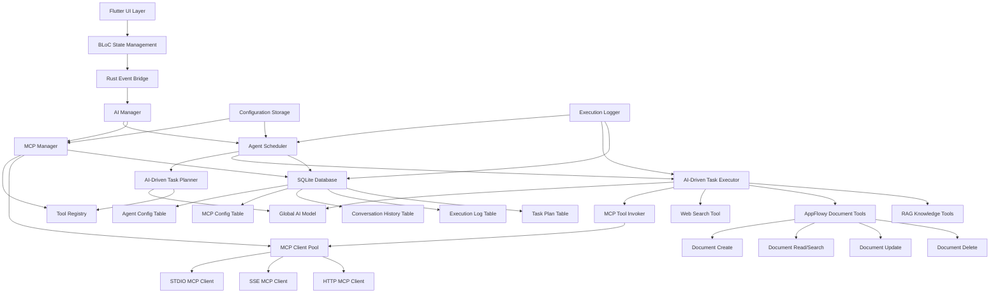

# AppFlowy MCP支持与AI助手智能体 — 设计说明书

## 概述

本设计文档描述了为AppFlowy引入Model Context Protocol (MCP)管理能力和AI助手智能体功能的技术实现方案。该功能将在现有AI聊天基础上构建一个可扩展的工具调用框架，支持智能体规划、执行和日志记录，并提供跨平台的配置管理界面。

## 指导文档对齐

### 技术标准 (tech.md)
- 遵循AppFlowy的Flutter前端 + Rust后端架构模式
- 使用现有的事件驱动通信机制（AFPlugin/AFPluginDispatcher）
- 复用现有的KVStorePreferences配置存储系统
- 遵循现有的BLoC状态管理模式
- 使用现有的多语言支持框架（EasyLocalization）

### 项目结构 (structure.md)
- MCP相关代码放置在rust-lib/flowy-ai/src/mcp/目录
- 智能体相关代码放置在rust-lib/flowy-ai/src/agent/目录
- Flutter UI组件放置在appflowy_flutter/lib/plugins/ai_chat/目录
- 设置界面扩展现有的settings页面结构
- 多语言文件放置在frontend/resources/translations/目录
- 遵循现有的protobuf定义和事件映射模式

## 代码复用分析

### 现有组件复用
- **AIManager**: 扩展以支持MCP工具管理和智能体调度
- **ChatServiceMiddleware**: 复用流式响应处理机制
- **SettingsAIBloc**: 扩展以支持MCP配置管理
- **KVStorePreferences**: 复用配置存储和作用域管理
- **AFPluginDispatcher**: 复用事件分发机制
- **RustStreamReceiver**: 复用实时数据流处理

### 集成点
- **现有AI事件系统**: 扩展AIEvent枚举以支持MCP和智能体事件
- **用户设置系统**: 集成到现有的三层设置界面（服务器端/移动端/工作空间）
- **聊天界面**: 扩展现有聊天UI以显示智能体执行过程和工具调用结果
- **数据库存储**: 复用现有的SQLite存储方案保存智能体配置和执行日志

## 架构

整体架构采用分层设计，将MCP管理、智能体调度和工具执行分离为独立模块，通过清晰的接口进行交互。

### 模块化设计原则
- **单文件职责**: 每个文件处理一个特定的领域或关注点
- **组件隔离**: 创建小而专注的组件，避免大型单体文件
- **服务层分离**: 分离数据访问、业务逻辑和表示层
- **工具模块化**: 将工具分解为专注的单一目的模块



## 组件和接口

### MCP管理器 (MCPManager)
- **目的**: 管理MCP服务器连接、工具发现和调用
- **接口**: 
  - `connect_server(config: MCPServerConfig) -> Result<(), FlowyError>`
  - `disconnect_server(server_id: String) -> Result<(), FlowyError>`
  - `list_tools(server_id: String) -> Result<Vec<MCPTool>, FlowyError>`
  - `call_tool(server_id: String, tool_name: String, params: Value) -> Result<Value, FlowyError>`
- **依赖**: MCPClient, KVStorePreferences
- **复用**: 扩展现有的flowy-ai/src/mcp/manager.rs

### 智能体调度器 (AgentScheduler)
- **目的**: 管理智能体生命周期、任务规划和执行协调
- **接口**:
  - `create_agent(config: AgentConfig) -> Result<AgentId, FlowyError>`
  - `update_agent(agent_id: AgentId, config: AgentConfig) -> Result<(), FlowyError>`
  - `delete_agent(agent_id: AgentId) -> Result<(), FlowyError>`
  - `list_agents() -> Result<Vec<AgentInfo>, FlowyError>`
  - `start_conversation(agent_id: AgentId, user_input: String) -> Result<ConversationId, FlowyError>`
  - `process_message(conversation_id: ConversationId, message: String) -> Result<AgentResponse, FlowyError>`
- **依赖**: TaskPlanner, TaskExecutor, ExecutionLogger, AgentConfigManager
- **复用**: 新建组件，复用现有的AI调用机制

### 智能体配置管理器 (AgentConfigManager)
- **目的**: 管理智能体的配置信息，包括名字、个性说明等
- **接口**:
  - `save_agent_config(config: AgentConfig) -> Result<(), FlowyError>`
  - `load_agent_config(agent_id: AgentId) -> Result<AgentConfig, FlowyError>`
  - `list_agent_configs() -> Result<Vec<AgentConfig>, FlowyError>`
  - `delete_agent_config(agent_id: AgentId) -> Result<(), FlowyError>`
- **依赖**: SQLite数据库
- **复用**: 复用现有的数据库访问模式

### AI驱动任务规划器 (AI-Driven TaskPlanner)
- **目的**: 基于全局AI大模型和智能体个性配置分析用户问题，智能生成解决方案和子任务
- **接口**:
  - `plan_tasks(agent_config: AgentConfig, problem: String, available_tools: Vec<Tool>) -> Result<TaskPlan, FlowyError>`
  - `replan_on_failure(agent_config: AgentConfig, failed_task: Task, error: String) -> Result<TaskPlan, FlowyError>`
- **依赖**: AIManager (全局AI模型), ToolRegistry, AgentConfigManager
- **复用**: 复用现有的AI模型调用机制，扩展支持工具感知的规划
- **AI驱动特性**: 利用AI模型的推理能力进行任务分解和工具选择，结合智能体个性进行个性化规划
- **个性化特性**: 在规划过程中融入智能体的个性说明和系统提示词

### AI驱动任务执行器 (AI-Driven TaskExecutor)
- **目的**: 基于全局AI大模型的工具调用功能和智能体个性执行具体的子任务
- **接口**:
  - `execute_task(agent_config: AgentConfig, task: Task) -> Result<TaskResult, FlowyError>`
  - `execute_with_retry(agent_config: AgentConfig, task: Task, max_retries: u32) -> Result<TaskResult, FlowyError>`
  - `reflect_and_adjust(agent_config: AgentConfig, task: Task, result: TaskResult) -> Result<Task, FlowyError>`
- **依赖**: AIManager (全局AI模型), MCPManager, ToolRegistry, AgentConfigManager
- **复用**: 复用现有的AI模型工具调用基础设施
- **AI驱动特性**: 利用AI模型的工具调用功能和反思能力进行智能执行
- **个性化特性**: 在执行过程中保持智能体的个性特征和行为风格

### 工具注册表 (ToolRegistry)
- **目的**: 管理所有可用工具的元数据和调用接口
- **接口**:
  - `register_tool(tool: ToolDefinition) -> Result<(), FlowyError>`
  - `get_available_tools(agent_id: AgentId) -> Vec<ToolDefinition>`
  - `get_tool_schema(tool_id: String) -> Result<ToolSchema, FlowyError>`
- **依赖**: 无
- **复用**: 新建组件

### 执行日志器 (ExecutionLogger)
- **目的**: 记录智能体执行过程中的所有操作和结果
- **接口**:
  - `log_planning(conversation_id: ConversationId, plan: TaskPlan)`
  - `log_execution(task_id: TaskId, result: TaskResult)`
  - `get_conversation_logs(conversation_id: ConversationId) -> Vec<ExecutionLog>`
- **依赖**: SQLite存储
- **复用**: 复用现有的数据库访问模式

### MCP工具调用器 (MCPToolInvoker)
- **目的**: 专门处理MCP工具的调用和结果处理
- **接口**:
  - `invoke_mcp_tool(server_id: String, tool_name: String, params: Value) -> Result<Value, FlowyError>`
  - `get_mcp_tool_schema(server_id: String, tool_name: String) -> Result<ToolSchema, FlowyError>`
- **依赖**: MCPClientPool
- **复用**: 新建组件

### Web搜索工具 (WebSearchTool)
- **目的**: 提供网络搜索能力
- **接口**:
  - `search(query: String, options: SearchOptions) -> Result<SearchResults, FlowyError>`
- **依赖**: HTTP客户端
- **复用**: 新建组件，为未来扩展预留

### AppFlowy文档工具 (AppFlowyDocumentTools)
- **目的**: 提供AppFlowy内置的文档CRUD操作能力
- **接口**:
  - `create_document(workspace_id: String, title: String, content: String) -> Result<DocumentId, FlowyError>`
  - `read_document(doc_id: String) -> Result<Document, FlowyError>`
  - `search_documents(query: String) -> Result<Vec<Document>, FlowyError>`
  - `update_document(doc_id: String, content: String) -> Result<(), FlowyError>`
  - `delete_document(doc_id: String) -> Result<(), FlowyError>`
- **依赖**: 现有的文档服务
- **复用**: 复用现有的文档管理API，专注于文档CRUD操作

### MCP客户端池 (MCPClientPool)
- **目的**: 管理不同传输方式的MCP客户端
- **接口**:
  - `get_client(server_id: String) -> Result<Arc<dyn MCPClient>, FlowyError>`
  - `create_stdio_client(config: MCPStdioConfig) -> Result<StdioMCPClient, FlowyError>`
  - `create_sse_client(config: MCPHttpConfig) -> Result<SSEMCPClient, FlowyError>`
  - `create_http_client(config: MCPHttpConfig) -> Result<HttpMCPClient, FlowyError>`
- **依赖**: 各种MCP客户端实现
- **复用**: 扩展现有的MCP客户端基础

## 数据模型

### MCP服务器配置 (MCPServerConfig)
```rust
pub struct MCPServerConfig {
    pub id: String,
    pub name: String,
    pub icon: String,
    pub transport_type: MCPTransportType,
    pub is_active: bool,
    pub description: String,
    pub created_at: DateTime<Utc>,
    pub updated_at: DateTime<Utc>,
    pub stdio_config: Option<MCPStdioConfig>,
    pub http_config: Option<MCPHttpConfig>,
}

pub enum MCPTransportType {
    Stdio,
    Http,
}

pub struct MCPStdioConfig {
    pub command: String,
    pub args: Vec<String>,
    pub env_vars: HashMap<String, String>,
}

pub struct MCPHttpConfig {
    pub url: String,
    pub headers: HashMap<String, String>,
}
```

### 智能体配置 (AgentConfig)
```rust
pub struct AgentConfig {
    pub id: String,
    pub name: String,
    pub description: String,
    pub personality: String,
    pub system_prompt: String,
    pub available_tools: Vec<String>,
    pub max_iterations: u32,
    pub temperature: f32,
    pub created_at: DateTime<Utc>,
    pub updated_at: DateTime<Utc>,
}
```

### 会话历史 (ConversationHistory)
```rust
pub struct ConversationHistory {
    pub id: String,
    pub agent_id: String,
    pub user_id: String,
    pub messages: Vec<ConversationMessage>,
    pub status: ConversationStatus,
    pub created_at: DateTime<Utc>,
    pub updated_at: DateTime<Utc>,
}

pub struct ConversationMessage {
    pub id: String,
    pub conversation_id: String,
    pub role: MessageRole,
    pub content: String,
    pub metadata: Value,
    pub timestamp: DateTime<Utc>,
}

pub enum MessageRole {
    User,
    Agent,
    System,
}

pub enum ConversationStatus {
    Active,
    Completed,
    Paused,
    Error,
}
```

### 任务计划 (TaskPlan)
```rust
pub struct TaskPlan {
    pub id: String,
    pub conversation_id: String,
    pub problem_description: String,
    pub tasks: Vec<Task>,
    pub created_at: DateTime<Utc>,
}

pub struct Task {
    pub id: String,
    pub description: String,
    pub tool_name: String,
    pub parameters: Value,
    pub dependencies: Vec<String>,
    pub status: TaskStatus,
}

pub enum TaskStatus {
    Pending,
    InProgress,
    Completed,
    Failed,
}
```

### 执行日志 (ExecutionLog)
```rust
pub struct ExecutionLog {
    pub id: String,
    pub conversation_id: String,
    pub log_type: LogType,
    pub timestamp: DateTime<Utc>,
    pub content: Value,
}

pub enum LogType {
    Planning,
    ToolCall,
    TaskResult,
    Error,
}
```

## 错误处理

### 错误场景
1. **MCP连接失败**
   - **处理**: 记录详细错误信息，提供重试机制，显示连接状态
   - **用户影响**: 显示连接错误提示，提供手动重连选项

2. **工具调用超时**
   - **处理**: 设置合理超时时间，实现重试逻辑，记录超时日志
   - **用户影响**: 显示执行进度，提供取消选项

3. **智能体规划失败**
   - **处理**: 回退到简单对话模式，记录规划失败原因
   - **用户影响**: 提示规划失败，继续提供基础AI对话服务

4. **配置验证失败**
   - **处理**: 提供详细的验证错误信息，高亮错误字段
   - **用户影响**: 显示具体的配置错误和修复建议

## 测试策略

### 单元测试
- MCP客户端连接和工具调用测试
- 智能体规划逻辑测试
- 任务执行器功能测试
- 配置验证和存储测试

### 集成测试
- MCP服务器集成测试（使用模拟MCP服务器）
- 智能体端到端工作流测试
- 跨平台配置同步测试
- 多语言界面测试

### 端到端测试
- 用户创建和配置智能体的完整流程
- 智能体解决复杂问题的场景测试
- MCP工具调用的实际使用场景
- 错误恢复和重试机制测试
