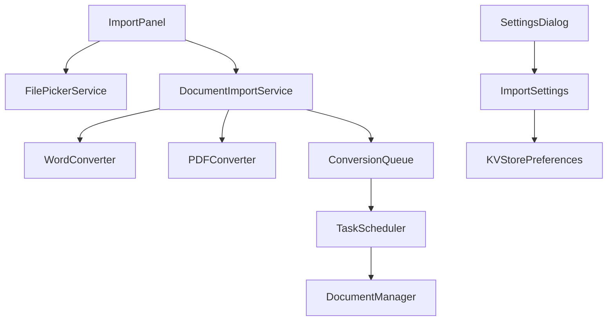

# 文档导入功能设计文档

## 概述

本文档描述了 AppFlowy 文档导入功能的扩展设计，该功能将支持从本地计算机导入 Microsoft Office Word 和 PDF 文档，并将其转换为 AppFlowy 文档格式。该功能将集成到现有的导入系统中，利用 AppFlowy 的模块化架构和现有的任务队列机制。

## 指导文档对齐

### 技术标准 (tech.md)
设计遵循 AppFlowy 的技术标准：
- 使用 Rust 后端处理文档转换逻辑
- 使用 Flutter 前端提供用户界面
- 遵循现有的 protobuf 通信协议
- 利用现有的任务队列和进度跟踪机制

### 项目结构 (structure.md)
实现将遵循项目组织约定：
- Rust 后端逻辑位于 `rust-lib/flowy-document/` 和 `rust-lib/flowy-folder/`
- Flutter 前端界面位于 `appflowy_flutter/lib/workspace/presentation/home/menu/sidebar/import/`
- 设置界面位于 `appflowy_flutter/lib/workspace/application/settings/`
- 多语言文件位于 `resources/translations/`

## 代码重用分析

### 现有组件利用
- **ImportPanel**: 扩展现有的导入面板以支持 Word 和 PDF 文件类型
- **FilePickerService**: 重用现有的文件选择服务
- **UploadTaskQueue**: 利用现有的上传任务队列机制处理转换队列
- **TaskScheduler**: 使用现有的任务调度器管理转换任务
- **KVStorePreferences**: 利用现有的键值存储系统保存导入设置
- **EasyLocalization**: 使用现有的多语言系统

### 集成点
- **ImportBackendService**: 扩展现有的导入后端服务
- **DocumentManager**: 集成到现有的文档管理系统
- **SettingsDialogBloc**: 扩展现有的设置对话框状态管理
- **AppearanceSettingsPB**: 扩展现有的外观设置以包含导入配置

## 架构

### 模块化设计原则
- **单一文件职责**: 每个文件处理特定的文档转换或UI组件
- **组件隔离**: 创建小型、专注的组件而不是大型单体文件
- **服务层分离**: 分离数据访问、业务逻辑和表示层
- **工具模块化**: 将工具分解为专注的、单一用途的模块



## 组件和接口

### DocumentImportService
- **目的**: 管理文档导入流程，协调文件选择、转换和文档创建
- **接口**: 
  - `importDocuments(List<File> files, String parentViewId)`
  - `getConversionProgress(String taskId)`
  - `getConversionLogs(String taskId)`
- **依赖**: FilePickerService, ConversionQueue, DocumentManager
- **重用**: 现有的 ImportBackendService 和任务管理机制

### WordConverter
- **目的**: 将 Word 文档转换为 AppFlowy 文档格式
- **接口**:
  - `convertWordDocument(String filePath) -> ConversionResult`
  - `extractImages(String filePath) -> List<ImageData>`
  - `extractTables(String filePath) -> List<TableData>`
- **依赖**: docx-rs 库, DocumentBuilder
- **重用**: 现有的文档构建器和图片处理机制

### PDFConverter
- **目的**: 将 PDF 文档转换为 AppFlowy 文档格式
- **接口**:
  - `convertPDFDocument(String filePath) -> ConversionResult`
  - `extractTextWithLayout(String filePath) -> TextData`
  - `extractImages(String filePath) -> List<ImageData>`
- **依赖**: lopdf 或 pdfium-render 库, DocumentBuilder
- **重用**: 现有的文档构建器和文本处理机制

### ConversionQueue
- **目的**: 管理文档转换任务队列和进度跟踪
- **接口**:
  - `addConversionTask(ConversionTask task)`
  - `getTaskStatus(String taskId) -> TaskStatus`
  - `cancelTask(String taskId)`
- **依赖**: TaskScheduler, TaskQueue
- **重用**: 现有的 UploadTaskQueue 和 TaskScheduler 机制

### ImportSettings
- **目的**: 管理导入功能的配置设置
- **接口**:
  - `getImportSettings() -> ImportSettingsPB`
  - `updateImportSettings(ImportSettingsPB settings)`
  - `getDefaultImportPath() -> String`
- **依赖**: KVStorePreferences
- **重用**: 现有的设置管理系统

## 数据模型

### ConversionTask
```
- id: String (unique identifier)
- file_path: String
- file_name: String
- file_type: ImportType (Word, PDF)
- status: TaskStatus (Pending, Processing, Completed, Failed)
- progress: f32 (0.0 to 1.0)
- created_at: SystemTime
- started_at: Option<SystemTime>
- completed_at: Option<SystemTime>
- error_message: Option<String>
- parent_view_id: String
```

### ConversionResult
```
- task_id: String
- document_id: String
- document_name: String
- success: bool
- error_message: Option<String>
- converted_elements: Vec<ConvertedElement>
- processing_time: Duration
```

### ImportSettingsPB
```
- max_concurrent_conversions: i32
- default_import_path: String
- preserve_formatting: bool
- extract_images: bool
- extract_tables: bool
- log_level: LogLevel
- auto_create_folder: bool
```

### ConvertedElement
```
- element_type: ElementType (Text, Image, Table, List)
- content: String
- formatting: Option<FormattingInfo>
- position: Position
- metadata: Map<String, String>
```

## 错误处理

### 错误场景
1. **文件格式不支持**
   - **处理**: 验证文件扩展名和MIME类型，返回明确的错误消息
   - **用户影响**: 显示"不支持的文件格式"错误，建议使用支持的格式

2. **文件损坏或无法读取**
   - **处理**: 捕获文件读取异常，记录详细错误信息
   - **用户影响**: 显示"文件损坏或无法读取"错误，建议检查文件完整性

3. **转换超时**
   - **处理**: 设置转换超时限制，自动取消长时间运行的任务
   - **用户影响**: 显示"转换超时"错误，提供重试选项

4. **内存不足**
   - **处理**: 监控内存使用，对大文件进行分块处理
   - **用户影响**: 显示"文件过大"错误，建议分割文件或增加内存

5. **权限不足**
   - **处理**: 检查文件访问权限，提供清晰的权限错误信息
   - **用户影响**: 显示"权限不足"错误，指导用户检查文件权限

## 测试策略

### 单元测试
- 测试各个转换器的核心功能
- 测试任务队列的添加、移除和状态更新
- 测试设置管理的数据持久化

### 集成测试
- 测试完整的导入流程（文件选择 → 转换 → 文档创建）
- 测试多文件并发转换
- 测试错误恢复和重试机制

### 端到端测试
- 测试用户界面交互流程
- 测试不同文件格式的转换质量
- 测试大文件处理性能
- 测试跨平台兼容性（macOS, Windows）
