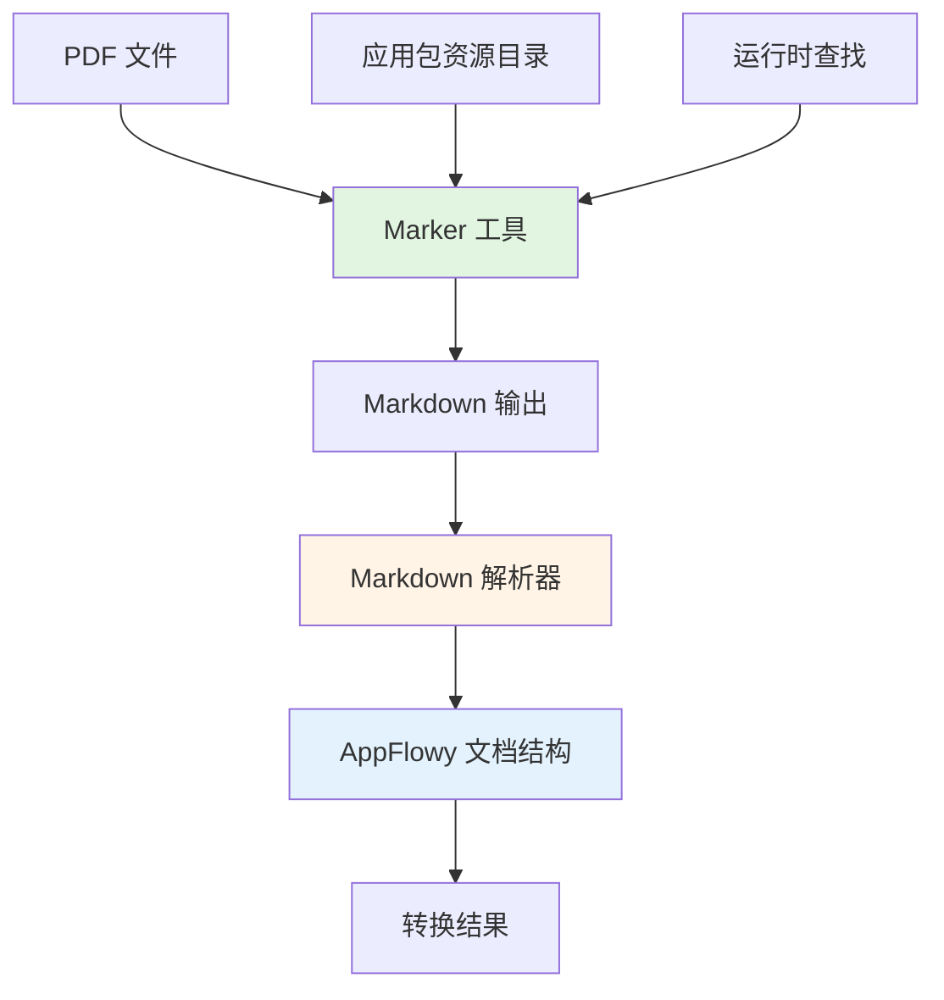

# PDF Marker 集成设计文档

## 概述

本文档详细描述了如何使用 Marker 工具重新设计 PDF 转换逻辑，将现有的 `pdftohtml` -> `htmltomarkdown` -> AppFlowy 文档的转换流程，替换为 PDF -> Markdown (via Marker) -> AppFlowy 文档的直接转换流程。Marker 工具将作为二进制文件打包到 macOS 和 Windows 应用包中，用户无需自行安装。

## Steering Document Alignment

### Technical Standards (tech.md)

当前项目使用 Rust 作为后端语言，Flutter 作为前端框架。遵循以下技术标准：
- 使用 `async-trait` 进行异步 trait 实现
- 使用 `flowy-error` 进行统一错误处理
- 使用 `tracing` 进行日志记录
- 遵循模块化设计原则，每个模块有单一职责

### Project Structure (structure.md)

PDF 转换功能位于 `rust-lib/flowy-document/src/import/` 目录下：
- `converter.rs`: 定义转换接口和数据结构
- `pdf_converter_native.rs`: 当前使用的 PDF 转换器实现
- `mod.rs`: 模块导出

## Code Reuse Analysis

### Existing Components to Leverage

- **`DocumentConverter` trait**: 保留现有的转换器接口，确保与现有代码兼容
- **`ConversionTask` 和 `ConversionResult`**: 复用现有的任务和结果数据结构
- **`ConversionConfig`**: 复用现有的配置结构
- **`ConversionQueue`**: 复用现有的转换队列管理机制
- **Markdown 解析器**: 复用 Flutter 端的 `customMarkdownToDocument` 函数，或使用 Rust 的 `pulldown-cmark` 库
- **图片提取机制**: 复用现有的图片提取和处理逻辑

### Integration Points

- **转换队列**: 新转换器将集成到现有的转换队列系统中
- **进度报告**: 通过现有的进度报告机制提供转换进度反馈
- **错误处理**: 使用现有的 `FlowyError` 错误处理机制
- **事件系统**: 通过现有的通知系统发送转换状态更新

## Architecture

### 整体架构

转换流程将从三阶段（PDF -> HTML -> Markdown -> AppFlowy）简化为两阶段（PDF -> Markdown -> AppFlowy）：



### Modular Design Principles

- **单一文件职责**: 
  - `marker_converter.rs`: Marker 工具调用和 Markdown 生成
  - `markdown_to_appflowy.rs`: Markdown 到 AppFlowy 文档的转换
  - `marker_tool_manager.rs`: Marker 工具的查找、验证和管理
- **组件隔离**: Marker 工具调用、Markdown 解析、AppFlowy 文档生成分离
- **服务层分离**: 工具管理、转换逻辑、错误处理分离
- **工具模块化**: Marker 工具查找、验证、执行封装为独立模块

## Components and Interfaces

### Component 1: MarkerToolManager

**Purpose:** 管理 Marker 工具的查找、验证和执行路径

**Interfaces:**
```rust
pub struct MarkerToolManager {
    marker_path: Option<PathBuf>,
}

impl MarkerToolManager {
    /// 创建新的管理器，自动查找 Marker 工具
    pub fn new() -> Self;
    
    /// 从应用包内查找 Marker 工具
    pub fn find_marker_in_bundle(&mut self) -> FlowyResult<PathBuf>;
    
    /// 验证 Marker 工具是否可用
    pub fn verify_marker(&self, path: &Path) -> FlowyResult<()>;
    
    /// 获取 Marker 工具路径
    pub fn get_marker_path(&self) -> FlowyResult<&Path>;
    
    /// 检查 Marker 工具是否可用
    pub fn is_available(&self) -> bool;
}
```

**Dependencies:** 
- `std::path::Path`
- `flowy_error::FlowyResult`

**Reuses:**
- 应用资源路径查找逻辑（参考现有代码模式）

### Component 2: MarkerPdfConverter

**Purpose:** 使用 Marker 工具将 PDF 转换为 Markdown

**Interfaces:**
```rust
pub struct MarkerPdfConverter {
    config: ConversionConfig,
    marker_manager: MarkerToolManager,
}

impl MarkerPdfConverter {
    /// 创建新的转换器
    pub fn new(config: ConversionConfig) -> FlowyResult<Self>;
    
    /// 执行 PDF 到 Markdown 的转换
    fn convert_pdf_to_markdown(
        &self,
        pdf_data: &[u8],
        output_path: &Path,
    ) -> FlowyResult<String>;
    
    /// 提取图片（Marker 工具会提取图片到输出目录）
    fn extract_images_from_marker_output(
        &self,
        output_dir: &Path,
    ) -> FlowyResult<Vec<ExtractedImage>>;
}
```

**Dependencies:**
- `MarkerToolManager`
- `ConversionConfig`
- `std::process::Command`

**Reuses:**
- `DocumentConverter` trait
- `ConversionTask` 和 `ConversionResult` 结构
- 现有的图片提取和处理逻辑

### Component 3: MarkdownToAppFlowyConverter

**Purpose:** 将 Markdown 内容转换为 AppFlowy 文档格式

**Interfaces:**
```rust
pub struct MarkdownToAppFlowyConverter {
    config: ConversionConfig,
}

impl MarkdownToAppFlowyConverter {
    /// 创建新的转换器
    pub fn new(config: ConversionConfig) -> Self;
    
    /// 将 Markdown 转换为 AppFlowy 文档内容
    fn convert_markdown_to_appflowy(
        &self,
        markdown: &str,
        images: &[ExtractedImage],
    ) -> FlowyResult<DocumentContent>;
    
    /// 解析 Markdown 标题
    fn parse_heading(&self, level: u32, text: &str) -> NestedBlock;
    
    /// 解析 Markdown 表格
    fn parse_table(&self, table_text: &str) -> NestedBlock;
    
    /// 解析 Markdown 代码块
    fn parse_code_block(&self, code: &str, language: Option<&str>) -> NestedBlock;
    
    /// 解析 Markdown 列表
    fn parse_list(&self, items: &[&str], ordered: bool) -> Vec<NestedBlock>;
    
    /// 处理图片引用
    fn process_image_reference(
        &self,
        image_path: &str,
        images: &[ExtractedImage],
    ) -> FlowyResult<NestedBlock>;
}
```

**Dependencies:**
- `pulldown-cmark`: Markdown 解析库
- `collab-document`: AppFlowy 文档结构
- `ConversionConfig`

**Reuses:**
- 现有的文档结构定义（`NestedBlock`）
- 图片嵌入逻辑

### Component 4: MarkerPdfConverter (主转换器实现)

**Purpose:** 实现 `DocumentConverter` trait，提供完整的 PDF 转换功能

**Interfaces:**
```rust
#[async_trait::async_trait]
impl DocumentConverter for MarkerPdfConverter {
    fn name(&self) -> &str;
    
    fn supported_types(&self) -> Vec<DocumentType>;
    
    async fn convert(&self, task: &ConversionTask) -> FlowyResult<ConversionResult>;
    
    async fn validate_file(&self, file_path: &Path) -> FlowyResult<()>;
    
    async fn get_file_info(&self, file_path: &Path) -> FlowyResult<DocumentMetadata>;
}
```

**Dependencies:**
- `MarkerPdfConverter` (内部组件)
- `MarkdownToAppFlowyConverter` (内部组件)
- `MarkerToolManager` (内部组件)

**Reuses:**
- `DocumentConverter` trait 定义
- 现有的转换任务和结果结构

## Data Models

### MarkerToolPath

```rust
/// Marker 工具路径配置
pub struct MarkerToolPath {
    /// 应用包内路径
    pub bundle_path: PathBuf,
    /// 备用系统路径（如果应用包内不可用）
    pub system_path: Option<PathBuf>,
}
```

### MarkerConversionOptions

```rust
/// Marker 工具转换选项
pub struct MarkerConversionOptions {
    /// 输出目录
    pub output_dir: PathBuf,
    /// 是否提取图片
    pub extract_images: bool,
    /// 是否保留格式
    pub preserve_formatting: bool,
    /// 超时时间（秒）
    pub timeout: Option<u64>,
}
```

### MarkdownConversionResult

```rust
/// Markdown 转换结果
pub struct MarkdownConversionResult {
    /// Markdown 文本内容
    pub markdown: String,
    /// 提取的图片列表
    pub images: Vec<ExtractedImage>,
    /// 图片目录路径
    pub image_dir: Option<PathBuf>,
}
```

## Error Handling

### Error Scenarios

1. **Marker 工具未找到**
   - **Handling:** 检查应用包内路径，如果不存在则返回详细错误信息
   - **User Impact:** 显示错误提示："Marker 工具未找到。请重新安装应用。"

2. **Marker 工具执行失败**
   - **Handling:** 捕获 stderr 输出，记录详细错误信息，返回转换失败结果
   - **User Impact:** 显示错误提示："PDF 转换失败：{具体错误信息}"

3. **PDF 文件无效**
   - **Handling:** 在调用 Marker 之前验证 PDF 文件格式
   - **User Impact:** 显示错误提示："无效的 PDF 文件格式"

4. **Markdown 解析失败**
   - **Handling:** 记录解析错误，尝试部分解析，返回可用的内容
   - **User Impact:** 显示警告，但继续处理可用的内容

5. **图片提取失败**
   - **Handling:** 记录警告，但不中断转换流程
   - **User Impact:** 转换完成，但部分图片可能缺失

6. **转换超时**
   - **Handling:** 设置超时机制，超时后终止进程并返回错误
   - **User Impact:** 显示错误提示："转换超时，请尝试较小的文件或联系支持"

## Testing Strategy

### Unit Testing

- **MarkerToolManager 测试**
  - 测试应用包内路径查找
  - 测试工具验证逻辑
  - 测试路径解析
  
- **MarkerPdfConverter 测试**
  - 测试 PDF 到 Markdown 转换
  - 测试错误处理
  - 测试超时机制

- **MarkdownToAppFlowyConverter 测试**
  - 测试 Markdown 解析
  - 测试各种 Markdown 元素转换（标题、表格、列表、代码块）
  - 测试图片引用处理

### Integration Testing

- **完整转换流程测试**
  - 测试从 PDF 文件到 AppFlowy 文档的完整转换
  - 测试各种复杂度的 PDF（简单文本、表格、图片、多列布局）
  - 测试大文件转换性能

- **错误场景测试**
  - 测试 Marker 工具缺失的情况
  - 测试无效 PDF 文件
  - 测试转换超时

### End-to-End Testing

- **用户场景测试**
  - 测试从 UI 导入 PDF 文件
  - 测试转换进度显示
  - 测试转换结果在 AppFlowy 中的显示
  - 测试图片是否正确嵌入

- **跨平台测试**
  - 在 macOS 上测试应用包内 Marker 工具查找
  - 在 Windows 上测试应用包内 Marker 工具查找
  - 测试不同版本的操作系统兼容性

## Marker 工具打包策略

### macOS 打包

1. **资源目录结构**
   ```
   AppFlowy.app/
   └── Contents/
       ├── Resources/
       │   └── marker/
       │       ├── marker (可执行文件)
       │       └── ... (依赖项，如 Python 环境，如果 Marker 基于 Python)
       └── ...
   ```

2. **查找逻辑**
   - 运行时从 `Bundle.main.resourcePath` 获取资源路径
   - 构建完整路径：`{resource_path}/marker/marker`
   - 验证可执行文件存在且可执行

### Windows 打包

1. **资源目录结构**
   ```
   AppFlowy/
   ├── AppFlowy.exe
   └── Resources/
       └── marker/
           ├── marker.exe (可执行文件)
           └── ... (依赖项)
   ```

2. **查找逻辑**
   - 运行时从应用安装目录获取路径
   - 构建完整路径：`{app_dir}/Resources/marker/marker.exe`
   - 验证可执行文件存在

### 构建时集成

1. **构建脚本修改**
   - 在 macOS 构建脚本中添加 Marker 工具复制步骤
   - 在 Windows 构建脚本中添加 Marker 工具复制步骤
   - 确保 Marker 工具及其依赖项正确打包

2. **依赖项处理**
   - 如果 Marker 基于 Python，需要打包 Python 解释器和依赖包
   - 或者使用 PyInstaller/类似工具将 Marker 打包为独立可执行文件
   - 考虑使用 Marker 的预编译二进制版本（如果可用）

## 性能优化

### 转换性能

- **并发处理**: 支持多个 PDF 文件并发转换（在队列管理器中）
- **内存管理**: 使用流式处理，避免一次性加载大文件到内存
- **缓存机制**: 缓存 Marker 工具路径，避免重复查找

### 进度报告

- **实时进度**: 通过 Marker 工具的 stdout 解析进度信息（如果支持）
- **阶段报告**: 报告转换的不同阶段（PDF 读取、Markdown 生成、文档转换）
- **时间估算**: 基于文件大小估算剩余时间

## 安全性考虑

### 文件操作安全

- **沙盒环境**: 所有临时文件在系统临时目录中创建
- **路径验证**: 验证所有文件路径，防止路径遍历攻击
- **权限检查**: 确保 Marker 工具具有适当的执行权限

### 输入验证

- **PDF 验证**: 在转换前验证 PDF 文件格式
- **输出验证**: 验证 Marker 工具的输出，防止恶意内容注入
- **大小限制**: 实施文件大小限制，防止资源耗尽攻击

## 代码清理计划

### 移除的代码

1. **`pdf_converter_native.rs`** 中的以下方法：
   - `try_pdftohtml()` - 移除 pdftohtml 调用
   - `html_to_markdown()` - 移除 HTML 到 Markdown 转换
   - `clean_html_before_markdown()` - 移除 HTML 清理逻辑
   - 所有与 pdftohtml 相关的代码

2. **依赖项移除**：
   - `html2md` crate（如果不再需要）
   - `html-escape` crate（如果不再需要，除非其他地方使用）

### 保留的代码

- `converter.rs` 中的接口定义和数据结构
- 图片提取和处理逻辑（可能需要适配）
- 转换队列和进度管理
- 元数据提取逻辑（可能需要适配 Marker 输出）

### 新增的代码

1. **`marker_tool_manager.rs`**: Marker 工具管理
2. **`marker_pdf_converter.rs`**: Marker PDF 转换器实现
3. **`markdown_to_appflowy.rs`**: Markdown 到 AppFlowy 转换器

## 迁移策略

### 渐进式迁移

1. **第一阶段**: 创建新的 `MarkerPdfConverter`，与现有转换器并行
2. **第二阶段**: 在 UI 中添加选项，允许用户选择使用新转换器
3. **第三阶段**: 默认使用新转换器，保留旧转换器作为回退
4. **第四阶段**: 完全移除旧转换器代码

### 兼容性保证

- 保持 `DocumentConverter` trait 接口不变
- 保持 `ConversionTask` 和 `ConversionResult` 结构不变
- 确保转换队列和进度报告机制兼容

