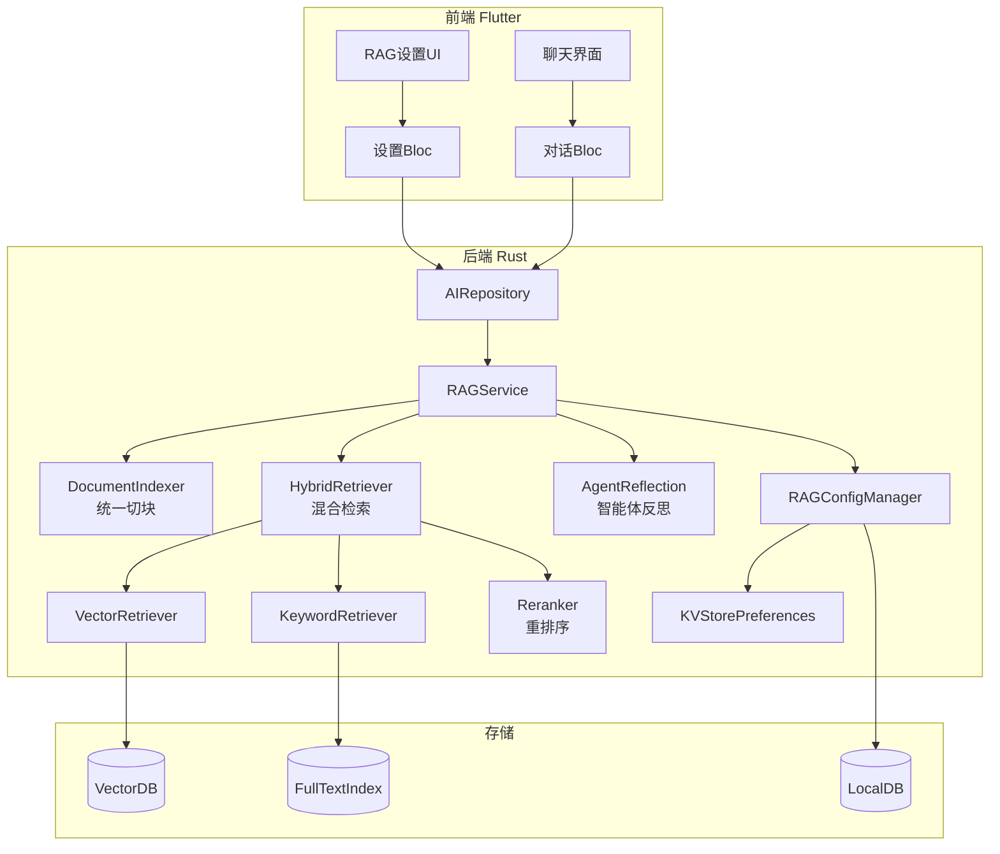

# RAG优化功能 — 设计文档

## 概述

本设计文档描述如何重构并优化AppFlowy智能体的RAG（检索增强生成）功能，引入混合检索、重排序机制和可配置的检索参数，以提升AI聊天中基于文档回答问题的准确性和可靠性。

该功能将：
1. **统一文档切块策略**：消除当前索引器和直接添加文档之间chunk_size不一致的问题（1000 vs 2000）
2. **实现混合检索**：结合向量检索和关键词检索，提高召回率
3. **添加重排序机制**：使用重排序模型从候选集中筛选最相关文档
4. **提供全局配置界面**：让用户可以根据场景灵活调整RAG参数
5. **集成智能体反思**：在回答后进行自我评估，确认是否解决了用户问题

## 对齐技术标准

### 代码复用分析

#### 现有组件

- **`DocumentIndexer`** (`rust-lib/flowy-ai/src/embeddings/document_indexer.rs`): 处理文档嵌入和切块
  - 需要修改：支持配置化的chunk_size和语义切片
  - 当前问题：chunk_size硬编码为1000（索引器）和2000（直接添加）

- **`SqliteVectorStore`** (`rust-lib/flowy-ai/src/embeddings/store.rs`): 向量存储和检索
  - 需要扩展：添加混合检索能力（向量+关键词）
  - 当前仅支持向量检索

- **`EmbedContext` / `EmbedScheduler`** (`rust-lib/flowy-ai/src/embeddings/scheduler.rs`): 嵌入调度器
  - 需要扩展：支持读取配置的检索参数
  - 当前limit硬编码为5

- **`AgentConfigManager`** (`rust-lib/flowy-ai/src/agent/config_manager.rs`): 配置管理
  - 需要新增：RAG全局设置管理

#### 集成点

- **Protobuf接口** (`rust-lib/flowy-ai/src/entities.rs`): 添加RAG配置相关的PB结构
- **Flutter设置UI** (`appflowy_flutter/lib/workspace/application/settings/`): 新增RAG设置页面
- **KVStorePreferences** (`flowy-sqlite`): 存储RAG配置到本地数据库
- **向量数据库** (`flowy-sqlite-vec`): 支持关键词检索（需要新增SQL全文搜索或集成外部搜索引擎）

## 架构设计

### 模块化设计原则

- **单一文件职责**：切块、检索、排序、配置各独立模块
- **组件隔离**：检索器、重排序器、配置管理器相互独立
- **服务层分离**：数据访问（向量DB）、业务逻辑（RAG流程）、呈现层（UI）分离
- **工具模块化**：将混合检索、重排序等拆分为可复用模块

### 架构图



## 核心组件设计

### 1. RAGConfigManager - RAG配置管理器

**文件位置**: `rust-lib/flowy-ai/src/rag/config_manager.rs`

**职责**: 
- 管理RAG全局配置（切块大小、检索策略、排序参数）
- 提供配置的读写接口
- 验证配置参数的合理性

**接口**:
```rust
pub struct RAGConfigManager {
    store_preferences: Arc<KVStorePreferences>,
}

impl RAGConfigManager {
    pub fn get_rag_settings(&self) -> RAGSettings;
    pub fn save_rag_settings(&self, settings: RAGSettings) -> FlowyResult<()>;
    pub fn validate_settings(&self, settings: &RAGSettings) -> FlowyResult<()>;
}
```

**数据结构**:
```rust
pub struct RAGSettings {
    // 文档切块配置
    pub chunk_size: usize,           // 默认1000
    pub chunk_overlap: usize,        // 默认200
    pub enable_semantic_splitting: bool, // 默认false
    
    // 检索配置
    pub enable_hybrid_search: bool,  // 默认true
    pub vector_weight: f32,           // 向量检索权重，默认0.7
    pub keyword_weight: f32,         // 关键词检索权重，默认0.3
    
    // 初筛和重排序配置
    pub initial_top_k: usize,        // 初筛top_k，默认10
    pub final_top_k: usize,          // 重排序后top_k，默认5
    pub enable_reranking: bool,      // 是否启用重排序，默认false（待实现）
    pub reranker_model: Option<String>, // 重排序模型名称
    
    // 智能体反思配置
    pub enable_agent_reflection: bool, // 默认true
    pub reflection_threshold: f32,   // 反思阈值，默认0.7
    
    pub created_at: SystemTime,
    pub updated_at: SystemTime,
}
```

### 2. HybridRetriever - 混合检索器

**文件位置**: `rust-lib/flowy-ai/src/rag/hybrid_retriever.rs`

**职责**:
- 执行向量检索和关键词检索
- 合并两类检索结果并按权重加权
- 去重并返回候选集

**接口**:
```rust
pub struct HybridRetriever {
    vector_store: Arc<dyn VectorStore>,
    keyword_store: Arc<dyn KeywordStore>, // 待实现
    config: RAGSettings,
}

impl HybridRetriever {
    pub async fn retrieve(
        &self,
        query: &str,
        workspace_id: &Uuid,
        object_ids: &[String],
    ) -> FlowyResult<Vec<RetrievedDocument>>;
}
```

**数据流**:
1. 并行执行向量检索和关键词检索
2. 合并结果并去重（基于document_id）
3. 按配置的权重计算综合分数
4. 返回综合分数排序后的候选集

### 3. Reranker - 重排序器

**文件位置**: `rust-lib/flowy-ai/src/rag/reranker.rs`

**职责**:
- 对初筛结果进行重排序
- 使用重排序模型计算文档与查询的相关性
- 降级处理（当模型不可用时）

**接口**:
```rust
pub struct Reranker {
    config: RAGSettings,
}

impl Reranker {
    pub async fn rerank(
        &self,
        query: &str,
        documents: Vec<RetrievedDocument>,
    ) -> FlowyResult<Vec<RetrievedDocument>>;
    
    fn rerank_by_score(&self, documents: Vec<RetrievedDocument>) -> Vec<RetrievedDocument>;
}
```

**策略**:
- 如果启用重排序且模型可用，使用模型重排序
- 否则，按初筛综合分数排序

### 4. 统一文档切块

**修改文件**: `rust-lib/flowy-ai/src/embeddings/document_indexer.rs`

**改动**:
- `create_embedded_chunks_from_text` 从配置读取chunk_size
- `split_text_into_chunks` 统一使用配置的chunk_size
- 修复索引器和直接添加文档的chunk_size不一致问题

**关键改动**:
```rust
impl Indexer for DocumentIndexer {
    fn create_embedded_chunks_from_text(
        &self,
        object_id: Uuid,
        paragraphs: Vec<String>,
        model: EmbeddingModel,
        config: Arc<RAGSettings>, // 新增参数
    ) -> Result<Vec<EmbeddedChunk>, FlowyError> {
        // 使用配置的chunk_size和chunk_overlap
        let chunk_size = config.chunk_size;
        let chunk_overlap = config.chunk_overlap;
        
        split_text_into_chunks(&object_id.to_string(), filtered_paragraphs, model, chunk_size, chunk_overlap)
    }
}
```

**同时修复**: `rust-lib/flowy-ai/src/embeddings/store.rs` 第235行
```rust
let chunks_result = split_text_into_chunks(
    &object_id_str,
    vec![paragraph],
    EmbeddingModel::NomicEmbedText,
    config.chunk_size,  // 从配置读取
    config.chunk_overlap, // 从配置读取
);
```

### 5. KeywordRetriever - 关键词检索器

**文件位置**: `rust-lib/flowy-ai/src/rag/keyword_retriever.rs`

**职责**:
- 执行基于关键词的全文搜索
- 使用TF-IDF或BM25计算相关性
- 返回关键词检索结果

**接口**:
```rust
pub trait KeywordStore: Send + Sync {
    async fn search(&self, query: &str, limit: usize) -> Result<Vec<KeywordDocument>>;
}

pub struct SQLiteKeywordStore {
    vector_db: Weak<VectorSqliteDB>,
}

impl KeywordStore for SQLiteKeywordStore {
    // 使用SQLite的全文搜索功能
    async fn search(&self, query: &str, limit: usize) -> Result<Vec<KeywordDocument>>;
}
```

**实现策略**:
- 使用SQLite FTS5扩展实现全文搜索
- 或者使用轻量级的Rust全文搜索库（如tantivy）

### 6. AgentReflection - 智能体反思机制

**文件位置**: `rust-lib/flowy-ai/src/rag/agent_reflection.rs`

**职责**:
- 智能体在回答后进行自我评估
- 判断是否成功解决了用户问题
- 提供改进建议或提示更多信息

**接口**:
```rust
pub struct AgentReflection {
    config: RAGSettings,
}

impl AgentReflection {
    pub async fn reflect(
        &self,
        user_question: &str,
        retrieved_docs: &[RetrievedDocument],
        ai_answer: &str,
    ) -> FlowyResult<ReflectionResult>;
}

pub struct ReflectionResult {
    pub confidence: f32,
    pub is_question_solved: bool,
    pub suggestion: Option<String>,
    pub missing_context: Option<Vec<String>>,
}
```

## 数据模型

### RAGSettings (RAG配置)

```rust
#[derive(Debug, Clone, Serialize, Deserialize)]
pub struct RAGSettings {
    // 文档切块配置
    pub chunk_size: usize,
    pub chunk_overlap: usize,
    pub enable_semantic_splitting: bool,
    
    // 检索配置
    pub enable_hybrid_search: bool,
    pub vector_weight: f32,
    pub keyword_weight: f32,
    
    // 初筛和重排序配置
    pub initial_top_k: usize,
    pub final_top_k: usize,
    pub enable_reranking: bool,
    pub reranker_model: Option<String>,
    
    // 智能体反思配置
    pub enable_agent_reflection: bool,
    pub reflection_threshold: f32,
    
    pub created_at: SystemTime,
    pub updated_at: SystemTime,
}

impl Default for RAGSettings {
    fn default() -> Self {
        Self {
            chunk_size: 1000,
            chunk_overlap: 200,
            enable_semantic_splitting: false,
            enable_hybrid_search: true,
            vector_weight: 0.7,
            keyword_weight: 0.3,
            initial_top_k: 10,
            final_top_k: 5,
            enable_reranking: false,
            reranker_model: None,
            enable_agent_reflection: true,
            reflection_threshold: 0.7,
            created_at: SystemTime::now(),
            updated_at: SystemTime::now(),
        }
    }
}
```

### RetrievedDocument (检索文档)

```rust
pub struct RetrievedDocument {
    pub document_id: String,
    pub content: String,
    pub metadata: HashMap<String, String>,
    pub vector_score: Option<f32>,
    pub keyword_score: Option<f32>,
    pub combined_score: f32,
    pub from_retrieval_type: RetrievalType, // Vector, Keyword, or Hybrid
}

pub enum RetrievalType {
    Vector,
    Keyword,
    Hybrid,
}
```

### ReflectionResult (反思结果)

```rust
pub struct ReflectionResult {
    pub confidence: f32,              // 0-1，答案的置信度
    pub is_question_solved: bool,    // 是否完全解决了问题
    pub suggestion: Option<String>,  // 改进建议
    pub missing_context: Option<Vec<String>>, // 缺失的上下文信息
    pub reflection_prompt: String,   // 反思过程提示
}
```

## 错误处理

### 错误场景

1. **配置参数无效** (如chunk_size=0, weights和>1)
   - **处理**: 在`RAGConfigManager::validate_settings`中验证
   - **用户影响**: 显示明确的错误提示和推荐值

2. **重排序模型不可用**
   - **处理**: 自动降级为按初筛分数排序
   - **用户影响**: 静默降级，不影响用户体验

3. **关键词检索功能未启用或配置错误**
   - **处理**: 降级为纯向量检索
   - **用户影响**: 日志记录警告，检索继续

4. **向量数据库连接失败**
   - **处理**: 返回空结果并提供重建提示
   - **用户影响**: 显示"无法访问文档库"错误

5. **切块大小变更导致已索引文档不一致**
   - **处理**: 检测不一致并提示用户重新索引
   - **用户影响**: 在设置界面显示警告和建议

## 测试策略

### 单元测试

- **RAGConfigManager**: 
  - 测试配置的读写和验证
  - 测试默认值的正确性
  
- **HybridRetriever**:
  - 测试向量检索和关键词检索的合并逻辑
  - 测试权重计算和去重
  
- **Reranker**:
  - 测试重排序逻辑
  - 测试降级处理

### 集成测试

- **完整RAG流程**: 
  - 从文档上传到检索到回答的全流程
  - 验证配置参数的影响
  
- **混合检索效果**:
  - 对比向量检索、关键词检索和混合检索的结果
  - 验证召回率和准确率提升

### 端到端测试

- **场景1**: 用户修改RAG配置并测试检索效果
- **场景2**: 智能体回答文档相关问题并进行反思
- **场景3**: 在macOS和Windows上分别测试RAG功能
- **场景4**: 测试中文和英文环境下的RAG功能

## 前端UI设计

### RAG设置界面

**文件位置**: `appflowy_flutter/lib/workspace/application/settings/ai/rag_setting_bloc.dart`

**UI组件**:
- 文档切块配置分组
  - chunk_size输入框（默认1000）
  - chunk_overlap输入框（默认200）
  - 语义切片开关
- 检索策略配置分组
  - 混合检索开关
  - 向量权重滑块（0-1）
  - 关键词权重滑块（0-1）
- 排序配置分组
  - 初筛top_k输入框（默认10）
  - 重排序后top_k输入框（默认5）
  - 重排序开关（初始为false，预留）
- 智能体反思配置分组
  - 反思开关
  - 反思阈值滑块（0-1）

**多语言支持**:
- 在 `resources/translations/` 中添加RAG设置相关翻译
- 使用 `generate_language_files.sh` 生成dart代码

## 实现优先级

1. **Phase 1**: 统一文档切块（高优先级）
2. **Phase 2**: RAG配置管理器和UI（高优先级）
3. **Phase 3**: 混合检索（中优先级）
4. **Phase 4**: 重排序（低优先级，可用性待验证）
5. **Phase 5**: 智能体反思（中优先级）

