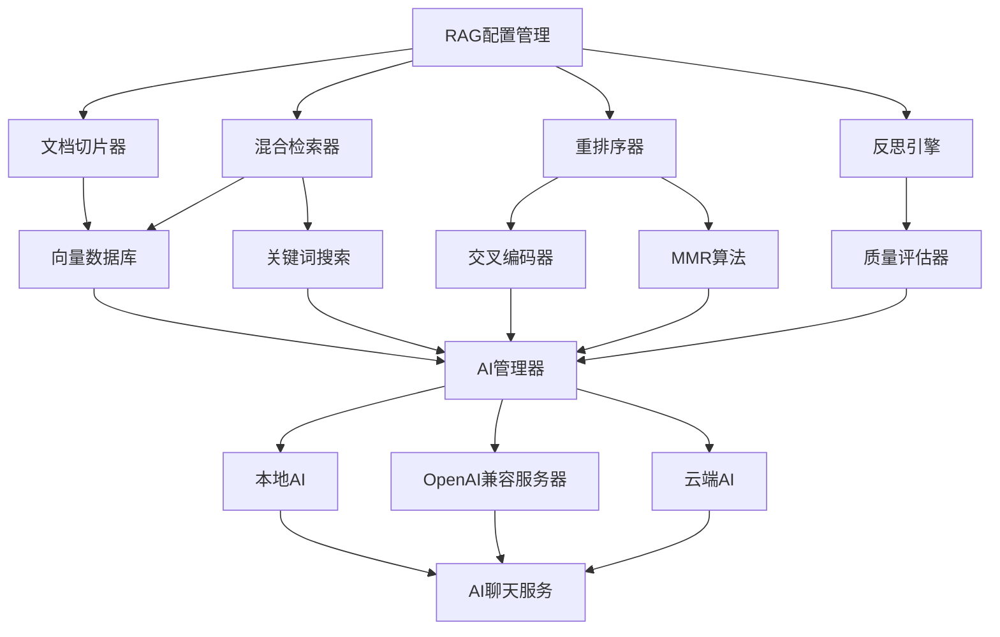

# RAG 优化设计文档

## 概述

本文档描述了 AppFlowy 文档 RAG（检索增强生成）系统的优化设计。通过重构嵌入、检索和生成三个阶段，提升 AI 聊天中回答问题的准确度。设计遵循 AppFlowy 的模块化架构原则，支持跨平台部署和多语言使用。

## Steering 文档对齐

### 技术标准 (tech.md)
设计遵循 AppFlowy 的技术标准：
- 使用 Rust 后端和 Flutter 前端的前后端分离架构
- 采用 protobuf 进行前后端通信
- 支持 macOS 和 Windows 跨平台部署
- 遵循现有的 AI 模块架构和配置管理模式

### 项目结构 (structure.md)
实现将遵循 AppFlowy 的项目组织约定：
- Rust 后端代码位于 `rust-lib/flowy-ai/` 目录
- Flutter 前端代码位于 `appflowy_flutter/lib/` 目录
- 配置管理使用现有的 KVStorePreferences 系统
- 多语言支持通过现有的翻译系统实现

## 代码重用分析

### 现有组件利用
- **DocumentIndexer**: 扩展现有的文档索引器，支持多种切片策略
- **SqliteVectorStore**: 重用现有的向量数据库存储和检索功能
- **Embedder**: 利用现有的嵌入模型接口，支持多种嵌入提供商
- **AIManager**: 扩展现有的 AI 管理器，支持本地 AI 和 OpenAI 兼容服务器的 RAG 功能
- **ChatServiceMiddleware**: 扩展现有的聊天服务中间件，根据全局选择的模型执行 RAG 任务
- **SettingsAIBloc**: 扩展现有的 AI 设置管理，添加 RAG 配置选项

### 集成点
- **KVStorePreferences**: 存储 RAG 配置参数
- **UserSettingsBackendService**: 管理用户设置的前后端通信
- **VectorIndexManager**: 集成新的检索和重排序功能
- **ChatServiceMiddleware**: 扩展现有的聊天服务中间件，支持多种 AI 提供商
- **AIModelSwitchListener**: 监听全局 AI 模型选择变化，动态调整 RAG 行为
- **OpenAICompatibleConfig**: 支持 OpenAI 兼容服务器的 RAG 配置

## 架构

### 模块化设计原则
- **单一文件职责**: 每个文件处理特定的 RAG 功能域
- **组件隔离**: 创建小型、专注的组件而非大型单体文件
- **服务层分离**: 分离数据访问、业务逻辑和表示层
- **工具模块化**: 将工具分解为专注的、单一用途的模块



## 组件和接口

### RAG 配置管理器
- **用途**: 管理所有 RAG 相关配置参数
- **接口**: 
  - `get_chunking_config() -> ChunkingConfig`
  - `get_retrieval_config() -> RetrievalConfig`
  - `get_reranking_config() -> RerankingConfig`
  - `get_reflection_config() -> ReflectionConfig`
- **依赖**: KVStorePreferences, UserSettingsBackendService
- **重用**: 扩展现有的 SettingsAIBloc

### 智能文档切片器
- **用途**: 提供多种文档切片策略
- **接口**:
  - `chunk_document(content: String, strategy: ChunkingStrategy) -> Vec<Chunk>`
  - `extract_metadata(document: Document) -> DocumentMetadata`
- **依赖**: text_splitter crate, NLP 处理库
- **重用**: 扩展现有的 DocumentIndexer

### 混合检索器
- **用途**: 结合向量搜索和关键词搜索
- **接口**:
  - `hybrid_search(query: String, config: RetrievalConfig) -> Vec<SearchResult>`
  - `vector_search(query: String, limit: usize) -> Vec<SearchResult>`
  - `keyword_search(query: String, limit: usize) -> Vec<SearchResult>`
- **依赖**: SqliteVectorStore, TantivySearchEngine
- **重用**: 扩展现有的 MultipleSourceRetrieverStore

### 重排序器
- **用途**: 对初步检索结果进行重新排序
- **接口**:
  - `rerank(results: Vec<SearchResult>, query: String, method: RerankingMethod) -> Vec<SearchResult>`
  - `cross_encoder_rerank(results: Vec<SearchResult>, query: String) -> Vec<SearchResult>`
  - `mmr_rerank(results: Vec<SearchResult>, query: String, lambda: f32) -> Vec<SearchResult>`
- **依赖**: 交叉编码器模型, MMR 算法实现
- **重用**: 新建组件

### 反思引擎
- **用途**: 评估答案质量并触发再检索或再生成
- **接口**:
  - `evaluate_answer(answer: String, context: Vec<SearchResult>) -> QualityScore`
  - `should_retry(score: QualityScore, threshold: f32) -> bool`
  - `trigger_regeneration(chat_id: Uuid, reason: String, ai_provider: AIProvider) -> Result<()>`
- **依赖**: 质量评估模型, AI 管理器（支持多种提供商）
- **重用**: 扩展现有的 ChatServiceMiddleware，支持本地 AI 和 OpenAI 兼容服务器

## 数据模型

### RAG 配置模型
```
RAGConfig:
- chunking: ChunkingConfig
- retrieval: RetrievalConfig  
- reranking: RerankingConfig
- reflection: ReflectionConfig
- language: String (zh-CN, en-US)
- platform: String (local, server)
```

### 切片配置模型
```
ChunkingConfig:
- strategy: ChunkingStrategy (fixed_size, semantic, hybrid)
- chunk_size: usize
- overlap: usize
- semantic_threshold: f32
- metadata_extraction: bool
```

### 检索配置模型
```
RetrievalConfig:
- hybrid_enabled: bool
- vector_weight: f32
- keyword_weight: f32
- top_k: usize
- score_threshold: f32
- reranking_enabled: bool
```

### 重排序配置模型
```
RerankingConfig:
- method: RerankingMethod (cross_encoder, mmr, hybrid)
- cross_encoder_model: String
- mmr_lambda: f32
- max_candidates: usize
```

### 反思配置模型
```
ReflectionConfig:
- enabled: bool
- quality_threshold: f32
- max_retries: usize
- evaluation_model: String
```

### AI 提供商配置模型
```
AIProviderConfig:
- provider_type: AIProviderType (local, openai_compatible, cloud)
- model_name: String
- rag_enabled: bool
- rag_config: RAGConfig
- fallback_provider: Option<AIProviderType>
```

## 错误处理

### 错误场景
1. **文档切片失败**
   - **处理**: 回退到固定大小切片，记录错误日志
   - **用户影响**: 显示警告信息，继续处理文档

2. **向量搜索失败**
   - **处理**: 回退到关键词搜索，记录错误日志
   - **用户影响**: 显示降级提示，返回部分结果

3. **重排序模型加载失败**
   - **处理**: 跳过重排序步骤，使用原始排序
   - **用户影响**: 显示性能警告，继续生成答案

4. **反思评估失败**
   - **处理**: 跳过质量评估，直接返回答案
   - **用户影响**: 显示功能降级提示

5. **AI 提供商切换失败**
   - **处理**: 回退到默认提供商，记录错误日志
   - **用户影响**: 显示提供商切换失败提示，使用备用提供商

## 测试策略

### 单元测试
- 测试各种切片策略的正确性
- 验证混合检索的权重计算
- 测试重排序算法的排序质量
- 验证反思引擎的质量评估逻辑

### 集成测试
- 测试完整的 RAG 工作流
- 验证配置变更的实时生效
- 测试多语言文档的处理
- 验证跨平台兼容性
- 测试不同 AI 提供商之间的切换
- 验证 RAG 功能在不同提供商下的表现

### 端到端测试
- 测试用户从配置到使用的完整流程
- 验证不同文档类型的处理效果
- 测试答案质量的提升效果
- 验证性能和资源使用情况
- 测试在不同 AI 提供商下的用户体验一致性
- 验证提供商切换时的数据一致性
