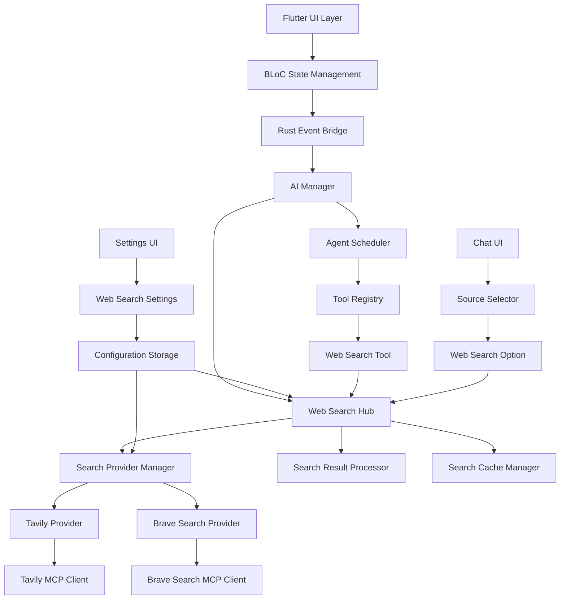

# Design Document

## Overview

本设计文档描述了为 AppFlowy 助手智能体添加网络搜索工具功能的技术实现方案。该功能将在现有 AI 聊天和 MCP 支持基础上，构建统一的网络搜索结果 Hub，支持 Tavily 和 Brave Search 两个搜索引擎供应商，并提供跨平台的配置管理和智能体工具集成。

## Steering Document Alignment

### Technical Standards (tech.md)
- 遵循 AppFlowy 的 Flutter 前端 + Rust 后端架构模式
- 使用现有的事件驱动通信机制（AFPlugin/AFPluginDispatcher）
- 复用现有的 KVStorePreferences 配置存储系统
- 遵循现有的 BLoC 状态管理模式
- 使用现有的多语言支持框架（EasyLocalization）

### Project Structure (structure.md)
- 网络搜索相关代码放置在 rust-lib/flowy-ai/src/web_search/ 目录
- Flutter UI 组件放置在 appflowy_flutter/lib/plugins/ai_chat/ 目录
- 设置界面扩展现有的 settings 页面结构
- 多语言文件放置在 frontend/resources/translations/ 目录
- 遵循现有的 protobuf 定义和事件映射模式

## Code Reuse Analysis

### Existing Components to Leverage
- **AIManager**: 扩展以支持网络搜索工具管理和智能体集成
- **ChatServiceMiddleware**: 复用流式响应处理机制
- **SettingsAIBloc**: 扩展以支持网络搜索配置管理
- **KVStorePreferences**: 复用配置存储和作用域管理
- **AFPluginDispatcher**: 复用事件分发机制
- **RustStreamReceiver**: 复用实时数据流处理
- **MCPManager**: 复用现有的 MCP 基础设施进行搜索引擎集成

### Integration Points
- **现有 AI 事件系统**: 扩展 AIEvent 枚举以支持网络搜索事件
- **用户设置系统**: 集成到现有的三层设置界面（服务器端/移动端/工作空间）
- **聊天界面**: 扩展现有聊天 UI 以显示网络搜索结果和引用信息
- **智能体工具系统**: 集成到现有的工具注册表和执行器

## Architecture

整体架构采用分层设计，将网络搜索管理、供应商适配和结果处理分离为独立模块，通过清晰的接口进行交互。

### Modular Design Principles
- **Single File Responsibility**: 每个文件处理一个特定的领域或关注点
- **Component Isolation**: 创建小而专注的组件，避免大型单体文件
- **Service Layer Separation**: 分离数据访问、业务逻辑和表示层
- **Utility Modularity**: 将工具分解为专注的单一目的模块



## Components and Interfaces

### Web Search Hub (WebSearchHub)
- **Purpose:** 统一管理网络搜索功能，提供统一的搜索接口
- **Interfaces:** 
  - `search(query: String, options: SearchOptions) -> Result<SearchResults, FlowyError>`
  - `get_active_provider() -> Option<SearchProvider>`
  - `set_active_provider(provider_id: String) -> Result<(), FlowyError>`
  - `test_provider(provider_id: String) -> Result<TestResult, FlowyError>`
- **Dependencies:** SearchProviderManager, SearchResultProcessor, SearchCacheManager
- **Reuses:** 扩展现有的 AI 工具基础设施

### Search Provider Manager (SearchProviderManager)
- **Purpose:** 管理不同的搜索引擎供应商
- **Interfaces:**
  - `register_provider(provider: SearchProvider) -> Result<(), FlowyError>`
  - `get_provider(provider_id: String) -> Option<SearchProvider>`
  - `list_providers() -> Vec<SearchProvider>`
  - `activate_provider(provider_id: String) -> Result<(), FlowyError>`
- **Dependencies:** KVStorePreferences
- **Reuses:** 复用现有的配置管理模式

### Tavily Provider (TavilyProvider)
- **Purpose:** 实现 Tavily 搜索引擎的集成
- **Interfaces:**
  - `search(query: String, options: TavilyOptions) -> Result<TavilyResults, FlowyError>`
  - `test_connection() -> Result<TestResult, FlowyError>`
  - `validate_api_key(api_key: String) -> Result<(), FlowyError>`
- **Dependencies:** MCPClient, HTTP 客户端
- **Reuses:** 复用现有的 MCP 客户端基础设施

### Brave Search Provider (BraveSearchProvider)
- **Purpose:** 实现 Brave Search 引擎的集成
- **Interfaces:**
  - `search(query: String, options: BraveOptions) -> Result<BraveResults, FlowyError>`
  - `test_connection() -> Result<TestResult, FlowyError>`
  - `validate_api_key(api_key: String) -> Result<(), FlowyError>`
- **Dependencies:** MCPClient, HTTP 客户端
- **Reuses:** 复用现有的 MCP 客户端基础设施

### Search Result Processor (SearchResultProcessor)
- **Purpose:** 统一处理不同供应商的搜索结果格式
- **Interfaces:**
  - `process_tavily_results(results: TavilyResults) -> SearchResults`
  - `process_brave_results(results: BraveResults) -> SearchResults`
  - `format_citations(results: SearchResults) -> Vec<Citation>`
- **Dependencies:** 无
- **Reuses:** 新建组件

### Search Cache Manager (SearchCacheManager)
- **Purpose:** 管理搜索结果的缓存
- **Interfaces:**
  - `get_cached_result(query: String) -> Option<SearchResults>`
  - `cache_result(query: String, results: SearchResults) -> Result<(), FlowyError>`
  - `clear_cache() -> Result<(), FlowyError>`
- **Dependencies:** KVStorePreferences
- **Reuses:** 复用现有的缓存存储机制

### Web Search Tool (WebSearchTool)
- **Purpose:** 为智能体提供网络搜索工具
- **Interfaces:**
  - `search(query: String, options: SearchOptions) -> Result<SearchResults, FlowyError>`
  - `get_tool_schema() -> ToolSchema`
- **Dependencies:** WebSearchHub
- **Reuses:** 集成到现有的工具注册表

### Web Search Settings UI (WebSearchSettingsUI)
- **Purpose:** 提供网络搜索配置的用户界面
- **Interfaces:**
  - `show_provider_config(provider_id: String)`
  - `test_provider_connection(provider_id: String)`
  - `save_provider_config(config: ProviderConfig)`
- **Dependencies:** WebSearchHub, SettingsAIBloc
- **Reuses:** 扩展现有的设置界面组件

### Source Selector UI (SourceSelectorUI)
- **Purpose:** 在聊天界面提供信息源选择
- **Interfaces:**
  - `show_source_options()`
  - `on_source_selected(source: SourceType)`
- **Dependencies:** ChatServiceMiddleware
- **Reuses:** 扩展现有的聊天界面组件

## Data Models

### Search Provider Configuration (SearchProviderConfig)
```rust
pub struct SearchProviderConfig {
    pub id: String,
    pub name: String,
    pub provider_type: SearchProviderType,
    pub is_active: bool,
    pub api_key: String,
    pub api_url: Option<String>,
    pub timeout: u64,
    pub max_results: u32,
    pub created_at: DateTime<Utc>,
    pub updated_at: DateTime<Utc>,
}

pub enum SearchProviderType {
    Tavily,
    BraveSearch,
}
```

### Search Results (SearchResults)
```rust
pub struct SearchResults {
    pub query: String,
    pub provider: SearchProviderType,
    pub results: Vec<SearchResult>,
    pub total_count: u32,
    pub search_time: Duration,
    pub cached: bool,
    pub timestamp: DateTime<Utc>,
}

pub struct SearchResult {
    pub title: String,
    pub url: String,
    pub snippet: String,
    pub content: Option<String>,
    pub relevance_score: f32,
    pub published_date: Option<DateTime<Utc>>,
}
```

### Search Options (SearchOptions)
```rust
pub struct SearchOptions {
    pub max_results: u32,
    pub include_content: bool,
    pub language: Option<String>,
    pub region: Option<String>,
    pub safe_search: bool,
    pub timeout: Duration,
}
```

### Citation (Citation)
```rust
pub struct Citation {
    pub title: String,
    pub url: String,
    pub snippet: String,
    pub relevance_score: f32,
}
```

### Test Result (TestResult)
```rust
pub struct TestResult {
    pub success: bool,
    pub response_time: Duration,
    pub error_message: Option<String>,
    pub sample_results: Option<Vec<SearchResult>>,
}
```

## Error Handling

### Error Scenarios
1. **API 密钥验证失败**
   - **Handling:** 记录详细错误信息，提供重新配置选项
   - **User Impact:** 显示配置错误提示，引导用户重新输入 API 密钥

2. **网络搜索超时**
   - **Handling:** 设置合理超时时间，实现重试逻辑，记录超时日志
   - **User Impact:** 显示搜索进度，提供取消选项，超时后显示错误信息

3. **搜索结果为空**
   - **Handling:** 提供搜索建议，记录搜索日志
   - **User Impact:** 显示"未找到相关结果"提示，提供搜索建议

4. **供应商服务不可用**
   - **Handling:** 自动切换到备用供应商，记录服务状态
   - **User Impact:** 显示服务状态，提供手动切换选项

5. **缓存存储失败**
   - **Handling:** 记录错误但不影响搜索功能，提供缓存清理选项
   - **User Impact:** 搜索功能正常，但可能影响性能

## Testing Strategy

### Unit Testing
- 搜索供应商连接和 API 调用测试
- 搜索结果处理和格式化测试
- 缓存管理功能测试
- 配置验证和存储测试

### Integration Testing
- 搜索引擎供应商集成测试（使用模拟 API）
- 网络搜索 Hub 端到端测试
- 跨平台配置同步测试
- 多语言界面测试

### End-to-End Testing
- 用户配置搜索引擎供应商的完整流程
- 智能体使用网络搜索工具的场景测试
- 聊天界面信息源选择的实际使用场景
- 错误恢复和重试机制测试
